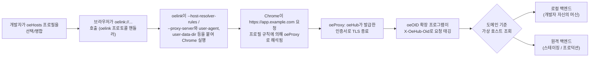

# 개요

## oeHub란

oeHub는 브라우저에서 개발 및 테스트 환경을 구축하고 전환하기 위한 셀프 호스팅 도구 허브입니다.
여러 백엔드(로컬, 스테이징, 프로덕션)를 동시에 다루는 팀이 반복적으로 겪는 문제를 해결합니다: 머신의
`/etc/hosts` 파일을 편집하거나 TLS 인증서를 수작업으로 관리하지 않고도, 실제와 똑같이 생긴 동일한
도메인 이름을 개발자별로, 작업별로 다른 백엔드로 향하게 하는 문제입니다.

하나의 로그인 아래 두 가지 도구가 번들되어 있습니다.

- **oeHosts**는 도메인-IP 매핑의 이름 붙은 프로필을 관리하고, 함께 사용하는 **oelink** 프로토콜
  핸들러를 통해 선택된 프로필의 규칙이 적용된 Chrome을 실행합니다.
- **oeProxy**는 해당 도메인들의 HTTPS를 로컬에서 종료하고 각 요청을 로컬 또는 원격 백엔드로
  리버스 프록시하여, 한 도메인이 어느 순간에는 개발자 자신의 머신을, 다음 순간에는 공유
  스테이징 서버를 투명하게 가리킬 수 있게 합니다.

두 도구 모두 같은 웹 애플리케이션을 통해 노출되고 하나의 사용자/세션 모델을 공유하지만, 각각
독립적으로도 유용합니다 — oeHosts는 oeProxy 없이도 동작하며(Chrome 자체의 호스트 리졸버가 표준
포트의 원격 서버를 바로 가리킬 수 있음), oeProxy의 가상 호스트는 oeHosts를 먼저 거친 클라이언트가
아니어도 어떤 클라이언트든 접근할 수 있습니다.

## oeHosts (+ oelink) 한눈에 보기

oeHosts는 사용자별로 이름 붙은 hosts 파일 형식 매핑("hosts 프로필")의 프로필을 저장합니다.
사용자는 여러 프로필을 가질 수 있고, 여러 개를 동시에 선택할 수 있으며, 사용 전에 병합된
규칙 집합을 미리 볼 수 있습니다. 웹 페이지에서 임의의 명령줄 플래그로 브라우저를 실행할 수는
없기 때문에, oeHosts는 실제 실행을 **oelink**에 위임합니다. oelink는 머신마다 한 번 설치되는
작은 커스텀 프로토콜 핸들러로, 브라우저가 `oelink://...`를 호출하면 oelink이 선택된 프로필로부터
만들어진 `--host-resolver-rules`(또는 그 대안으로 `--proxy-server`)와 커스텀 user agent, 격리된
`--user-data-dir`, 시크릿 모드 같은 플래그를 붙여 Chrome을 실행합니다. 전체 프로필 모델과
공개 범위/공유 규칙, oelink의 설치 및 플래그 집합은 [02-oehosts-and-oelink.md](02-oehosts-and-oelink.md)를
참고하세요.

## oeProxy (+ oeOID) 한눈에 보기

oeProxy는 가상 호스트를 위한 HTTPS 리버스 프록시로, oeHub가 생성(또는 관리자가 가져오기)한
자체 서명된 루트 인증서를 기반으로 합니다. 각 가상 호스트는 도메인을 로컬 또는 원격 백엔드에
매핑하므로, 인증서를 재발급하거나 DNS를 재구성하지 않고도 같은 도메인 이름이 그때그때 편리한
백엔드로 해석됩니다. 함께 사용하는 브라우저 확장 프로그램인 **oeOID**는 프록시를 거치는 요청에
`X-OeHub-Oid` 헤더를 태깅하여, (DHCP나 공유 네트워크 환경에서는 신뢰할 수 없는) 클라이언트 IP에
의존하는 대신 오리진 서비스가 요청을 보낸 oeHub 사용자를 직접 식별할 수 있게 합니다. oeProxy는
브라우저가 아닌 클라이언트와 모바일을 위한 상시 실행 포워드 프록시도 운영합니다. 실시간 트래픽
모니터와 포워드 프록시의 인증 및 화이트리스트 처리를 포함한 전체 내용은
[03-oeproxy.md](03-oeproxy.md)를 참고하세요.

## 기술 스택

- **[Javalin](https://javalin.io/)** — HTTP 계층: 라우팅, 필터, 요청/응답 처리.
- **[MyBatis](https://mybatis.org/mybatis-3/)** over **[H2](https://www.h2database.com/)** — 내장,
  파일 기반 데이터베이스에 대한 SQL 매퍼 영속성. 별도의 데이터베이스 서버를 운영할 필요가 없습니다.
- **[Pebble](https://pebbletemplates.io/)** — 서버 렌더링 HTML 템플릿.
- 클라이언트에서는 **순수 JavaScript + WebCrypto** — 프론트엔드 프레임워크나 클라이언트 빌드
  단계가 없으며, 페이지는 템플릿과 함께 제공되는 순수 HTML/CSS/JS입니다.
- 인증서 생성과 파싱(oeProxy의 루트 인증서 및 도메인별 인증서)을 위한
  **[BouncyCastle](https://www.bouncycastle.org/)**.

애플리케이션은 다중 사용자를 지원하며 역할 기반 접근 제어를 갖습니다(인스턴스 전체를 관리하는
`admin` 역할과 일반 `user` 계정). 최초 실행 시 설치 마법사가 초기 관리자 계정을 생성하고 oeProxy의
루트 인증서를 구성합니다.

## 배포 모드

oeHub는 배포 시점에 선택되는 두 가지 모드 중 하나로 실행됩니다: 하나의 인스턴스가 한 팀에게 두
도구를 모두 직접 제공하는 **standalone** 모드와, 공유/호스팅 배포를 위해 만들어져 oeProxy를
사용할 수 없고 hosts 프로필 내용이 종단간 암호화되어 서버가 평문을 전혀 볼 수 없는 **workspace** 모드가
있습니다. 이 문서 세트는 standalone을 기본 기준 틀로 다루며, 전체적인 구분과 각 모드에서 달라지는
점은 [04-deployment-modes.md](04-deployment-modes.md)를 참고하세요.

## 요청 흐름

다음 다이어그램은 standalone 모드에서 프로필 선택부터 백엔드 서버까지 하나의 요청이 거치는
경로를 보여줍니다.

프로필 선택과 실행에는 oeHosts와 브라우저만 관여합니다. Chrome이 요청을 보내는 순간부터는 그
아래의 모든 것(TLS, 요청 태깅, 가상 호스트가 현재 지정하고 있는 백엔드로의 라우팅)이 oeProxy의
책임입니다.

## 더 읽어보기

- [02-oehosts-and-oelink.md](02-oehosts-and-oelink.md) — oeHosts 프로필, 공개 범위와 공유,
  프리셋, 백업/복원, oelink 프로토콜 핸들러.
- [03-oeproxy.md](03-oeproxy.md) — 리버스 프록시, oeOID, 트래픽 모니터, 포워드 프록시.
- [04-deployment-modes.md](04-deployment-modes.md) — standalone 대 workspace 모드.
- [05-end-to-end-encryption.md](05-end-to-end-encryption.md) — workspace 모드에서 hosts 프로필
  내용이 어떻게 보호되는지.
- [06-security-model.md](06-security-model.md) — 두 도구 전반에 걸친 인증, 세션, 신뢰 경계
  세부사항.
