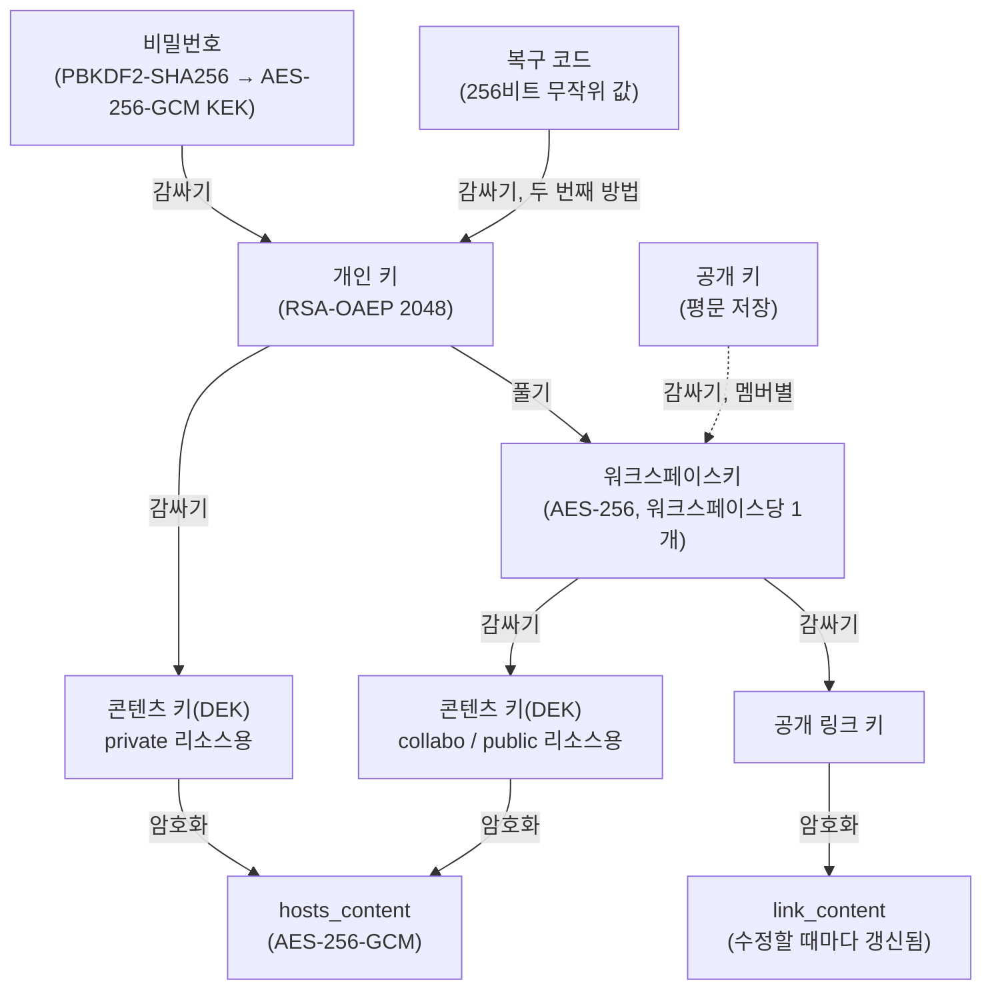

# 종단간 암호화

## 왜 필요한가

`workspace` 모드에서 oeHub는 멀티테넌트 클라우드 서비스입니다: 한 운영자가 서로 다른 팀이나 회사에
속한 여러 독립적인 워크스페이스를 호스팅하는 하나의 인스턴스를 운영합니다. 여기에 저장되는
내용 — 호스트-IP 매핑 — 은 워크스페이스의 내부 인프라 토폴로지(내부 서비스 이름, 스테이징
호스트, 환경 구성)를 드러낼 수 있습니다. 이는 운영자든, 데이터베이스나 그 백업에 접근하게 된
그 누구든 읽을 수 있어서는 안 되는 것입니다.

`standalone` 모드에서는 이 중 어느 것도 적용되지 않습니다. 운영자는 자신의 인프라에서 자신의
팀을 위해 oeHub를 운영하며, 이미 그 서버를 완전히 암묵적으로 신뢰하고 있습니다 — 다른 어떤
셀프 호스팅 관리 도구와도 다르지 않습니다. 따라서 `standalone`은 모든 내용을 평문으로 저장합니다.
부분적인 암호화도, "저장 시에는 암호화되어 있지만 운영자가 키를 쥐고 있는" 타협도, `standalone`의
실제 신뢰 모델과 부딪히면 유지되지 않을 보호를 주장하려는 시도도 없습니다. 두 모드에 대한 더
자세한 위협 모델 논의는 [06-security-model.md](06-security-model.md)를 참고하세요.

미리 밝혀둘 한 가지 추가 제약이 있습니다: `workspace` 모드에서 암호화 가능한 모든 것이 실제로
암호화되는 것은 아닙니다. 서버가 제 기능을 하기 위해 구조적으로 읽어야 하는 값들 — 예를 들어
서버 자신의 JWT 서명 키나 oeProxy의 HMAC 비밀값 — 은 제외됩니다. 서버가 읽을 수 없는 값은 그
값이 존재하는 목적을 위해 사용할 수 없기 때문입니다. oeProxy 자신의 가상 호스트 내용도 같은
범주에 속하며, 다음 절에서 구체적으로 다룹니다.

## 무엇이 (그리고 무엇이 아닌 것이) 암호화되는가, 그리고 그 이유

`HOSTS_PFILE.hosts_content`만이 암호화되며, 그것도 `oe.mode=workspace`일 때만 그렇습니다.

이는 "모든 콘텐츠 컬럼을 암호화한다"보다 좁은 범위이며, 그 이유는 취향의 문제가 아니라 구조적인
것입니다.

- **oeProxy의 가상 호스트 내용은 결코 암호화되지 않습니다.** 포워드 프록시는 선택된 각 프로필의
  호스트 내용을 직접 파싱해 라우팅 테이블을 구성하고, 리버스 프록시는 가상 호스트 YAML을 직접
  파싱해 라우트 테이블을 구성합니다. 두 작업 모두 테이블을 구성하는 순간 서버가 사용 가능한
  평문을 쥐고 있을 것을 요구합니다. 이 컬럼을 암호화하면 라우팅이 조용히 깨질 것입니다 — YAML
  파싱 실패는 빈 라우트 테이블을, hosts 파싱 실패는 매핑이 아예 없는 상태를 낳으며, 누구에게도
  명백한 오류가 드러나지 않습니다.
- **이것이 바로 oeProxy가 `workspace` 모드에서 아예 존재하지 않는 이유입니다**
  ([04-deployment-modes.md](04-deployment-modes.md) 참고). oeProxy의 서버들이 `workspace` 모드에서
  결코 시작되지 않으므로, 그 모드에는 그 내용을 평문으로 필요로 하는 코드 경로가 전혀 없습니다 —
  그래서 `workspace` 모드에서 `hosts_content`를 암호화해도 거기서는 아무런 충돌이 생기지 않습니다.
  `standalone`에서는 oeProxy가 실제로 실행되고 평문이 필요하므로, 이는 위의 신뢰 모델 논거에
  더해 `standalone`이 애초에 콘텐츠를 전혀 암호화하지 않는 또 하나의 이유가 됩니다.
- **사용자별 설정 값**(선호하는 open URL 동작이나 시크릿 모드 토글 같은 작은 설정)도 마찬가지로
  제외됩니다. 이들은 서버 렌더링 설정 화면에서 직접 읽히고 내보내기 페이로드에도 평문으로
  포함되는데, 둘 다 암호화를 지원하려면 클라이언트 측 재작성이 필요합니다. 더 중요한 것은, 이
  값들은 이 기능이 보호하려는 종류의 민감한 인프라 정보가 아니며, 다른 누구와도 공유되지 않는다는
  점입니다 — 이들은 애초에 `visibility` 개념 자체를 갖지 않습니다.

## 키 계층 구조

모든 사용자는 개인 RSA-OAEP(2048비트) 키 쌍을 가집니다. 공개 키는 워크스페이스의 누구든 그
사용자를 위해 무언가를 감쌀 필요가 있을 수 있으므로 평문으로 저장되며, 개인 키는 결코 평문으로
저장되지 않습니다 — 항상 감싸진 상태로만 저장되고, 오직 브라우저 안에서만 풀립니다.

- **개인 키 쌍(RSA-OAEP 2048, SHA-256)** — 사용자당 하나. 공개 키는 그 사용자를 위해 무언가를
  감싸려는 다른 누군가가 사용하고(승인 시점의 워크스페이스키 등), 개인 키는 로컬에서 풀린 뒤
  오직 그 사용자 자신의 브라우저에서만 사용됩니다.
- **비밀번호 기반 KEK** — 현재 OWASP 권고에 맞춘 높은 반복 횟수(배포된 상수는 60만 회)를 사용하는
  PBKDF2-SHA256이 사용자의 비밀번호로부터 AES-256-GCM 키를 유도합니다. 이 키는 개인 키를
  감쌉니다. 비밀번호로부터 결정론적으로 유도되므로 저장할 필요가 전혀 없습니다 — 브라우저는
  로그인할 때마다 단순히 이를 다시 유도합니다.
- **복구 코드** — 비밀번호와 별개로(비밀번호로부터 유도되지 않고) 생성되는 고엔트로피 무작위
  값으로, 같은 개인 키를 두 번째의, 독립적인 방법으로 감쌉니다. 가입 시 또는 재발급 동작을 통해
  요청 시 정확히 한 번 사용자에게 보여지며, 사용 가능한 형태로는 어디에도 저장되지 않습니다.
  그 목적은 개인 키의 보호를 약화시키지 않으면서 비밀번호 복구를 가능하게 하는 것입니다: 개인
  키는 두 개의 독립적인 비밀(비밀번호와 복구 코드)로 보호되며, 둘 중 하나만 있어도 이를 풀기에
  충분합니다.
- **워크스페이스키(AES-KW)** — 워크스페이스당 하나이며 모든 구성원이 공유합니다. 어디에도 평문으로
  저장되지 않는 대신, 각 구성원의 개인 공개 키로 개별적으로 감싸져서, 어떤 구성원이든 자신의
  개인 키만으로 자신의 사본을 풀 수 있습니다. 어떤 구성원도 워크스페이스키를 다른 구성원이나
  서버에 사용 가능한 형태로 전송하지 않습니다.
- **행별 콘텐츠 키(DEK, AES-256-GCM)** — 공유되는 리소스(hosts 프로필)마다 하나씩 무작위로
  생성되어 그 리소스의 내용을 직접 암호화하는 데 사용됩니다. 이 DEK 자체는 공개 범위에 따라 두
  키 중 하나로 감싸집니다: `private` 리소스는 소유자의 개인 키로, `collabo`와 `public` 리소스는
  워크스페이스키로 감쌉니다. 감싸는 동작 자체는 `collabo`와 `public` 두 경우에서 동일하며, 두
  공개 범위는 오직 검색/발견 범위에서만 다를 뿐 누가 내용을 복호화할 수 있는지에서는 결코
  다르지 않습니다.

이는 표준적인 봉투 암호화(AWS KMS 등 비슷한 시스템에서 쓰이는 것과 같은 패턴)입니다: DEK가
잠재적으로 큰 콘텐츠를 암호화하는 무거운 작업을 담당하고, KEK는 작고 고정된 크기의 키 하나만
감쌉니다. 이 분리 덕분에 키 회전이 저렴해집니다 — 아래 [워크스페이스키 회전](#워크스페이스키-회전)을
참고하세요.

서버는 이 콘텐츠 경로에 대해 감싸진 또는 암호화된 자료만 저장할 뿐, 스스로 복호화를 수행하는
일은 결코 없습니다. 개인 키든, 워크스페이스키든, 콘텐츠 DEK든, 모든 복호화는 브라우저에서
WebCrypto API를 통해 일어납니다. 서버의 역할은 암호문을 저장하고 브라우저 사이에서 옮기는 것으로
제한됩니다.

## 복구 흐름

복구 코드를 여전히 사용할 수 있다면, 비밀번호를 잃어버렸다고 해서 암호화된 콘텐츠에 대한
접근까지 잃어서는 안 됩니다. 이를 가능하게 하는 프로토콜은 서버가 복구 코드 자체 — 개인 키를
푸는 실제 키 자료 — 를 결코 알지 못하면서도, 어떤 요청이 그것을 정당하게 가지고 있음을 검증할 수
있도록 설계되어 있습니다.

**복구 검증값.** 브라우저는 HKDF-SHA256을 사용해 복구 코드로부터 단방향 값을 유도하고, 오직 그
유도된 값만 서버로 보냅니다 — 복구 코드 자체는 결코 보내지 않습니다. 서버는 이 검증값을 bcrypt로
해시하여 저장하고, 이를 두 번째 비밀번호처럼 정확히 다룹니다: 요청을 대조해 확인할 수는 있지만
복구 코드로 역산할 수는 없는 값입니다. 데이터베이스가 완전히 침해되더라도 복구 코드나 그것이
보호하는 개인 키는 노출되지 않습니다.

**2단계 복구.** 서버는 검증값으로부터 무언가를 유도하거나 재구성할 수 없기 때문에, 복구는 두
단계의 교환입니다.

1. 사용자가 자신의 사용자 ID와 복구 검증값을 제출합니다. 일치하면 서버는 감싸진 개인
   키(`wrapped_private_key_recovery`)를 반환합니다 — 여전히 암호문이며, 복구 코드 자체 없이는
   쓸모가 없습니다.
2. 브라우저는 (브라우저를 떠난 적 없는) 복구 코드를 사용해 개인 키를 풀고, 새로 정한 비밀번호로
   다시 감싸고, 완전히 새로운 복구 코드를 생성한 다음, 새로 감싼 개인 키, 새로운
   복구용-감싸진-개인 키, 새로운 검증값을 한 번의 작업으로 제출합니다. 이 과정이 완료되는 순간
   이전 복구 코드는 폐기되어 재사용할 수 없습니다.

두 요청 모두, 계정이 존재하지 않는지, 검증값이 등록되어 있지 않은지, 아니면 단순히 검증값이
일치하지 않는지와 무관하게 같은 일반적인 오류로 실패합니다 — 이는 어떤 계정이 존재하는지 유출되는
것을 막아줍니다. 검증 단계는 존재하지 않는 계정에 대해서도 조건 없이 bcrypt 비교를 수행하여,
응답 시간으로도 계정 존재 여부가 새어 나가지 않도록 합니다.

## 워크스페이스키 회전

위의 봉투 구조 덕분에, 워크스페이스키를 회전한다고 해서 워크스페이스의 모든 콘텐츠를 다시
암호화해야 하는 것은 아닙니다. 회전은 오직 워크스페이스키를 재생성하고, 영향을 받는 각
리소스의 기존 DEK를 새 키로 다시 감싸는 것만 수행합니다 — DEK 자체, 그리고 그것이 암호화하는
콘텐츠는 결코 변경되지 않습니다. 이것이 공유 리소스가 많은 워크스페이스에서도 회전이 빠르게
유지되는 이유입니다: 비용은 리소스의 총 콘텐츠 크기가 아니라 리소스의 개수에 비례합니다.

회전은 두 가지 상황에서 일어납니다.

- **구성원이 제거될 때 자동으로.** 이는 그 구성원이 앞으로의 공유 콘텐츠를 복호화할 수 있는
  능력을 무효화합니다. 새로운 감싸기 작업은 새 워크스페이스키를 사용하는데, 떠난 구성원은
  이를 결코 받지 못하기 때문입니다. 이는 그 구성원이 떠나기 전에 이미 로컬에서 복호화한
  콘텐츠는 무효화하지 **않습니다** — 그가 브라우저에서 이미 본 콘텐츠는 이미 본 것으로 남으며,
  어떤 회전 방식도 이를 소급하여 되돌릴 수 없습니다. 이 한계는 모델에 내재된 것이며 사용자에게
  숨겨지지 않습니다.
- **필요에 따라**, 키 유출이 의심되는 경우 등을 위한 수동 "지금 회전" 동작을 통해.

**실패 정책.** 구성원 제거로 인한 회전이 실패하면, 오래된 워크스페이스키를 그대로 둔 채 제거를
진행하는 대신 제거 자체가 중단됩니다 — 회전의 핵심 목적은 떠나는 구성원이 앞으로의 콘텐츠를
복호화할 수 없도록 만드는 것이므로, 성공적인 회전 없이 제거를 완료하면 그 목적이 무너집니다.
실패한 시도에서 복구하기 위한 수동 재시도(같은 "지금 회전" 동작)를 사용할 수 있습니다.

## 공개 링크 공유

리소스 소유자는 리소스별로 완전히 공개적인, 로그인이 필요 없는 링크를 생성하도록 선택할 수
있습니다 — 이는 워크스페이스 모델을 대체하는 것이 아니라 그 위에 얹히는 것이며, 여전히 구성원이
하나의 특정 리소스에 대해 의도적으로 선택해야 하는 것으로 남습니다.

링크의 내용은 리소스의 일반 콘텐츠 DEK와는 독립적인, 그 자신만의 전용 키로 암호화됩니다. 이
전용 링크 키 자체는 워크스페이스키로 감싸져 서버 측에 저장됩니다 — 이 덕분에 어떤 워크스페이스
구성원의 브라우저든 원본 리소스가 편집될 때마다 링크에 저장된 내용을 갱신할 수 있어서, 링크가
오래된 상태로 남지 않습니다. 하지만 링크를 실제로 복호화해 보는 데 필요한 *원본*, 감싸지지 않은
키는 결코 서버로 전송되거나 서버에 저장되지 않습니다. 이 키는 오직 브라우저에서 다루는 URL의
프래그먼트 부분(`https://.../oelink#key=...`)에만 존재합니다 — 브라우저는 URL 프래그먼트를 HTTP
요청으로 전송하지 않으므로, 이 키는 서버 접근 로그에 남거나 서버에 도달하는 일이 전혀 없습니다.

**브라우저가 아닌 도구를 위한 일반 텍스트 변형.** SwitchHosts 같은 일부 hosts 파일 동기화 도구는
일반 HTTP GET 요청만 보내고 JavaScript를 실행할 수 없어서, URL 프래그먼트를 읽을 수 없습니다.
이를 위해 oeHub는 같은 원본 키를 쿼리 파라미터로 전달하는 두 번째 링크 형태를 제공합니다. 이는
실제로 존재하는, 명시적으로 밝혀진 트레이드오프입니다: 프래그먼트와 달리 쿼리스트링 값은 요청의
일부이며 서버 접근 로그에 남을 수 있습니다. 이 형태의 링크를 발급하는 사람은 누구든 이를 그
로그를 읽을 수 있는 사람만큼 노출된 것으로 취급해야 합니다 — 이는 사용자가 이런 종류의 링크를
생성하는 시점에 명시적으로 안내되며, 암묵적으로 남겨두지 않습니다.

## 리소스의 공개 범위 변경

리소스를 다른 공개 범위로 옮기는 것은 기존 내용을 건드리지 않고 콘텐츠 키만 다시 감쌉니다.

- **`private`로 옮기면** 콘텐츠 키를 소유자의 개인 키로 다시 감쌉니다.
- **`public` 또는 `collabo`로 옮기면** 콘텐츠 키를 워크스페이스키로 다시 감쌉니다.
- 리소스가 `public` 공개 범위를 벗어나는 순간, 살아있는 공개 링크는 자동으로 폐기됩니다 — 더 이상
  공개될 의도가 없는 콘텐츠에 오래된 접근 권한을 가진 채로 링크가 방치되지 않습니다.
