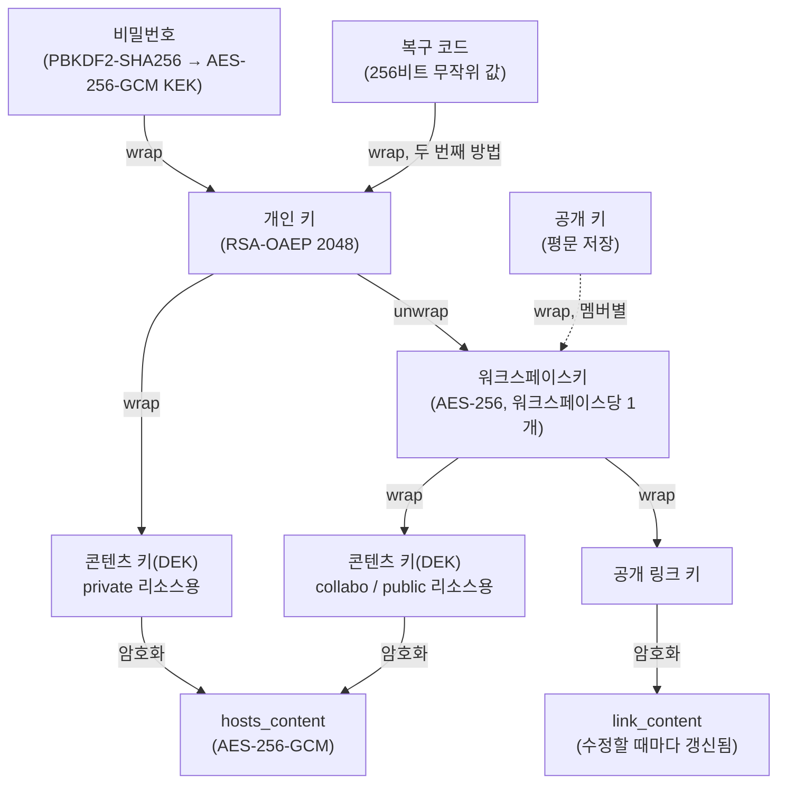

# 종단간 암호화

`workspace` 모드는 여러 워크스페이스를 하나의 인스턴스가 호스팅하는 멀티테넌트 서비스라 운영자도 호스트-IP 매핑 내용을 읽을 수 없어야 하지만, `standalone`은 이미 신뢰하는 자신의 서버이므로 전부 평문으로 저장한다 (위협 모델 비교는 [06-security-model.md](06-security-model.md) 참고).

## 적용 범위

암호화 대상은 `HOSTS_PFILE.hosts_content` 하나뿐이며, 그것도 `oe.mode=workspace`일 때만 적용된다.

- **oeProxy 가상 호스트 내용은 암호화되지 않는다.** 포워드/리버스 프록시가 라우팅 테이블을 만들려면 평문이 필요하기 때문이다. 이 때문에 `workspace` 모드에서는 oeProxy 자체가 실행되지 않는다([04-deployment-modes.md](04-deployment-modes.md)).
- **사용자별 설정 값**(open URL 동작, 시크릿 모드 토글 등)도 대상이 아니다. 서버가 직접 읽어 렌더링/내보내기에 쓰며, 애초에 `visibility` 개념이 없는 값이다.

## 키 계층 구조

사용자마다 개인 RSA-OAEP(2048비트) 키 쌍을 가진다. 공개 키는 평문 저장, 개인 키는 항상 wrap된 채로만 저장되고 브라우저에서만 unwrap된다.

다이어그램이 렌더링되지 않는 환경(텍스트 뷰어 등)에서는 아래 체인으로 읽으면 된다.

- 비밀번호 → wrap → 개인 키 ← wrap ← 복구 코드 (두 방법 중 하나로 unwrap 가능)
- 개인 키 → unwrap → 워크스페이스키 ← wrap(멤버별) ← 각 구성원 공개 키
- 워크스페이스키 → wrap → 콘텐츠 키(DEK, collabo/public용)
- 개인 키 → wrap → 콘텐츠 키(DEK, private용)
- 콘텐츠 키(DEK) → 암호화 → `hosts_content`
- 워크스페이스키 → wrap → 공개 링크 키 → 암호화 → `link_content`

- **개인 키 쌍(RSA-OAEP 2048)** — 사용자당 하나. 공개 키는 다른 구성원이 이 사용자를 위해 뭔가를 감쌀 때 쓰고, 개인 키는 이 사용자의 브라우저에서만 쓰인다.
- **비밀번호 기반 KEK** — PBKDF2-SHA256(반복 60만 회)으로 비밀번호에서 AES-256-GCM 키를 유도해 개인 키를 wrap한다. 결정론적으로 유도되므로 저장하지 않는다.
- **복구 코드** — 비밀번호와 독립적으로 생성되는 고엔트로피 값으로, 같은 개인 키를 두 번째 방법으로 wrap한다. 가입/재발급 시 한 번만 노출되고 저장되지 않는다. 즉 개인 키는 비밀번호·복구 코드 두 비밀 중 하나만 있어도 unwrap된다.
- **워크스페이스키(AES-KW)** — 워크스페이스당 하나. 평문 저장 없이 각 구성원의 공개 키로 개별 wrap되어, 각자 자기 개인 키로만 자기 사본을 unwrap한다.
- **행별 콘텐츠 키(DEK, AES-256-GCM)** — 리소스(hosts 프로필)마다 무작위 생성되어 내용을 직접 암호화한다. `private`는 소유자 개인 키로, `collabo`/`public`은 워크스페이스키로 wrap한다 — 두 공개 범위는 복호화 권한이 아니라 검색 범위에서만 다르다.

표준 봉투 암호화 패턴(AWS KMS류)으로, DEK가 콘텐츠 암호화를, KEK가 작은 키 하나의 wrap만 담당한다. 이 분리 덕분에 키 회전이 저렴하다.

서버는 wrap되거나 암호화된 자료만 저장·전달할 뿐 복호화는 하지 않는다. 모든 복호화는 브라우저의 WebCrypto API에서 일어난다.

## 복구 흐름

복구 코드를 알고 있으면, 비밀번호를 잃어도 콘텐츠 접근권을 잃지 않는다. 서버는 복구 코드 자체를 결코 알지 못한 채로 요청의 정당성만 검증한다.

1. **검증값**: 브라우저가 HKDF-SHA256으로 복구 코드에서 단방향 값을 유도해 그 값만 서버로 보낸다. 서버는 이를 bcrypt로 해시해 저장하고, 두 번째 비밀번호처럼 취급한다 — DB가 통째로 유출돼도 복구 코드나 개인 키는 드러나지 않는다.
2. **2단계 교환**:
   - 사용자가 ID + 검증값을 제출 → 일치하면 서버가 wrap된 개인 키(`wrapped_private_key_recovery`, 여전히 암호문)를 반환한다.
   - 브라우저가 (서버로 나간 적 없는) 복구 코드로 개인 키를 unwrap하고, 새 비밀번호로 다시 wrap하고, 새 복구 코드를 생성해 한 번에 제출한다. 이 순간 이전 복구 코드는 폐기된다.

두 요청 모두 계정 존재 여부와 무관하게 같은 일반 오류/타이밍으로 실패해, 계정 존재 여부가 새지 않는다.

## 워크스페이스키 회전

봉투 구조 덕분에 회전은 워크스페이스키를 재생성하고 각 리소스의 DEK를 새 키로 다시 wrap하기만 한다 — DEK와 콘텐츠 자체는 바뀌지 않는다. 비용이 콘텐츠 크기가 아니라 리소스 개수에 비례해, 회전이 빠르다.

- **구성원 제거 시 자동 실행.** 새 워크스페이스키를 못 받는 떠난 구성원은 이후 공유 콘텐츠를 복호화할 수 없게 된다. 단, 떠나기 전 이미 로컬에서 본 콘텐츠까지 소급 무효화하지는 못한다 — 모델에 내재된 한계다.
- **필요 시 수동으로.** 키 유출이 의심될 때 등 "지금 회전" 동작으로 실행한다.

**실패 정책**: 구성원 제거로 인한 회전이 실패하면 제거 자체를 중단한다 — 회전 없는 제거는 떠난 구성원의 접근을 못 끊기 때문이다. 같은 "지금 회전" 동작으로 재시도한다.

## 공개 링크 공유

리소스 소유자는 리소스별로 로그인 불필요한 공개 링크를 선택적으로 만들 수 있다. 워크스페이스 모델 위에 얹히는 것이며, 리소스마다 의도적으로 켜야 한다.

링크 내용은 리소스의 일반 콘텐츠 DEK와 별개인 전용 키로 암호화된다. 이 전용 키는 워크스페이스키로 wrap되어 서버에 저장되므로(어느 구성원의 브라우저든 원본 수정 시 링크 내용을 갱신할 수 있음), 링크는 항상 최신 상태다. 하지만 실제로 복호화할 수 있는 *wrap되지 않은* 키는 서버로 전송되지 않고 URL 프래그먼트(`https://.../oelink#key=...`)에만 존재한다 — 프래그먼트는 HTTP 요청에 포함되지 않으므로 서버 접근 로그에도 남지 않는다.

**비-브라우저 도구용 평문 변형.** SwitchHosts 등 JS를 실행하지 못하는 도구를 위해, 같은 키를 쿼리 파라미터로 전달하는 두 번째 링크 형태도 제공한다. 이 값은 서버 접근 로그에 남을 수 있다는 트레이드오프가 있으며, 발급 시점에 사용자에게 명시적으로 안내된다.

## 리소스의 공개 범위 변경

공개 범위 변경은 콘텐츠는 그대로 둔 채 콘텐츠 키만 다시 wrap한다.

- `private`로 옮기면 → 소유자 개인 키로 다시 wrap한다.
- `public`/`collabo`로 옮기면 → 워크스페이스키로 다시 wrap한다.
- `public`을 벗어나면 → 살아있는 공개 링크는 자동 폐기된다.
