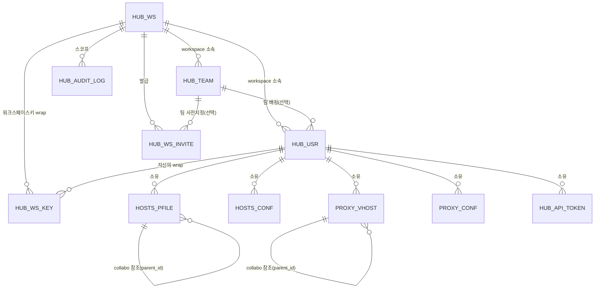

# 데이터베이스 스키마

이 문서는 oeHub가 사용하는 14개 테이블을 다룬다. 스키마는 `DatabaseConfig.initSchema()`(H2, `CREATE TABLE IF NOT EXISTS`)에 코드로 정의되어 있으며, 이 문서는 그 코드를 그대로 옮긴 것이 아니라 각 테이블의 존재 이유와 컬럼 설계 의도를 설명한다. 아래 컬럼 표는 이름과 역할만 간단히 보여줄 뿐이며, 정확한 타입/제약조건은 소스가 원본이다.

개발 단계에서는 `ALTER TABLE`을 쓰지 않는다. 스키마를 바꾸려면 `CREATE TABLE` 문 자체를 고치고, 기존 데이터베이스 파일(`self-hosted` 모드는 `~/oeHub/data/oeHub-h2.*`, `workspace` 모드는 `~/oeHub/data/oeHub-h2-ws.*`)을 지운 뒤 재시작한다. `CREATE TABLE IF NOT EXISTS`는 테이블이 이미 있으면 아무 일도 하지 않는다. 그래서 이 파일을 지우지 않은 채 새 컬럼이 추가된 코드로 재시작하면, 기존 테이블에 그 컬럼이 없는 상태로 남아 조회 시 SQL 오류가 난다.

## 공통 규칙

특별히 언급하지 않는 한 모든 테이블은 다음 네 컬럼을 가진다: `created_by`/`updated_by`(행을 만들거나 마지막으로 수정한 `HUB_USR.user_no`)와 `create_at`/`updated_at`(타임스탬프). 이 둘은 **외래키 제약을 걸지 않는다**(소프트 레퍼런스). 실제 FK를 걸면, 그 사람이 예전에 한 번이라도 만들거나 건드린 행이 남아있는 한 계정 삭제 자체가 막히기 때문이다. 행위자를 알 수 없는 시스템 동작(마이그레이션 등)은 `0`을 쓴다. `HUB_USR.user_no`는 `1000000000`부터 시작하도록 설계되어 있어, `0`은 실제 회원 번호와 절대 겹치지 않는 예약값이다. 아래 각 테이블의 컬럼 표에도 이 네 컬럼이 매번 등장하지만, 설명은 이 문단으로 대신한다.

## 관계도

## `HUB_WS` — 워크스페이스

테넌시의 최상위 단위. `self-hosted` 모드에서도 정확히 1행만 존재한다(§[04-deployment-modes.md](04-deployment-modes.md) "self-hosted가 특수한 경우가 아닌 이유" 참고) — "워크스페이스가 없는 모드"가 아니라 "워크스페이스가 1개로 고정된 모드"이기 때문이다.

| 컬럼 | 설명 |
|---|---|
| `ws_no` | 기본키 |
| `ws_name` | 워크스페이스 이름 (유일) |
| `status` | `active` / `suspended` |
| `created_by` | 생성자 `user_no` (소프트 레퍼런스) |
| `updated_by` | 마지막 수정자 `user_no` (소프트 레퍼런스) |
| `create_at` | 생성 일시 |
| `updated_at` | 마지막 수정 일시 |

- `status` — `active`/`suspended`. 인스턴스 admin의 워크스페이스 콘솔이 이 값을 토글한다. `suspended`가 되면 로그인이 즉시 차단되고(`AuthController.processLogin`), 이미 발급된 세션도 `token_version` 전체 증가로 함께 무효화된다.

## `HUB_TEAM` — 팀(부서) 라벨

워크스페이스 아래 한 단계짜리 조직 라벨. 검색·공유 범위와는 무관한 순수 필터/표시용이다(`HOSTS_PFILE.share_scope`가 그 역할을 계속 전담). `wsa` 누구나 생성/이름변경/삭제할 수 있고, 소속 사용자가 있는 팀은 삭제가 거부된다(먼저 재배정해야 함). `HUB_USR`보다 먼저 생성돼야 `HUB_USR.team_no`의 FK가 성립한다.

| 컬럼 | 설명 |
|---|---|
| `team_no` | 기본키 |
| `ws_no` | 소속 워크스페이스 (FK → `HUB_WS`) |
| `team_name` | 팀 이름 (같은 워크스페이스 안에서 유일) |
| `created_by` | 생성자 `user_no` (소프트 레퍼런스) |
| `updated_by` | 마지막 수정자 `user_no` (소프트 레퍼런스) |
| `create_at` | 생성 일시 |
| `updated_at` | 마지막 수정 일시 |

## `HUB_USR` — 사용자 계정

| 컬럼 | 설명 |
|---|---|
| `user_no` | 기본키 (`1000000000`부터 시작) |
| `user_id` | 로그인 ID (유일) |
| `password` | 비밀번호 해시 (bcrypt) |
| `role` | `adm` / `wsa` / `usr` / `wss` / `pen` |
| `ws_no` | 소속 워크스페이스 (FK → `HUB_WS`) |
| `team_no` | 소속 팀 (FK → `HUB_TEAM`, nullable) |
| `token_version` | JWT 무효화 카운터 |
| `public_key` | 종단간 암호화 공개키 |
| `wrapped_private_key` | 비밀번호 KEK로 감싼 개인키 |
| `wrapped_private_key_recovery` | 비밀번호 재설정 코드 KEK로 감싼 개인키 |
| `recovery_verifier` | 비밀번호 재설정 코드 검증용 해시 |
| `created_by` | 생성자 `user_no` (소프트 레퍼런스) |
| `updated_by` | 마지막 수정자 `user_no` (소프트 레퍼런스) |
| `create_at` | 생성 일시 |
| `updated_at` | 마지막 수정 일시 |
| `last_login_at` | 마지막 로그인 일시 (nullable) |

- `role` — 3글자 코드(`VARCHAR(3)`). `adm`(인스턴스 관리자) / `wsa`(워크스페이스 관리자, 한 워크스페이스에 여러 명 가능) / `usr`(일반 사용자) / `wss`(로그인 불가능한 워크스페이스 소유 계정 — [소유자를 잃은 리소스](04-deployment-modes.md#계정-삭제와-소유자를-잃은-리소스)의 새 주인) / `pen`(승인 대기, 로그인 불가).
- `team_no` — nullable. 팀 미배정도 정상 상태다.
- `token_version` — 비밀번호 변경, 워크스페이스 정지 등으로 증가하며, 그 시점 이전에 발급된 JWT를 전부 무효화한다.
- `public_key`/`wrapped_private_key`/`wrapped_private_key_recovery`/`recovery_verifier` — 종단간 암호화의 개인키/복구 자료([05-end-to-end-encryption.md](05-end-to-end-encryption.md) 참고). `self-hosted` 모드에서는 공개키만 실제 값이고 나머지 세 컬럼은 고정 더미 문자열이다 — 아무도 그 계정의 콘텐츠를 암호화하지 않으므로 실제 키 자료를 만들 필요가 없다.
- `last_login_at` — 휴면 계정을 찾아 정리하는 용도(별도 상태 플래그 없이, `wsa`이 직접 보고 삭제하는 방식).

## `HUB_WS_INVITE` — 초대 코드

1인당 1회용 개별 코드(워크스페이스 전체가 공유하는 재사용 코드가 아님 — 코드 하나가 유출돼도 그 초대 하나만 위험해진다). `used`가 `TRUE`가 되는 순간 재사용 불가하며, `expires_at`이 지나도 마찬가지다. `team_no`(nullable)로 가입과 동시에 팀을 지정할 수 있다.

| 컬럼 | 설명 |
|---|---|
| `invite_code` | 기본키 |
| `ws_no` | 대상 워크스페이스 (FK → `HUB_WS`) |
| `team_no` | 가입과 동시에 배정할 팀 (FK → `HUB_TEAM`, nullable) |
| `used` | 사용 여부 |
| `created_by` | 생성자 `user_no` (소프트 레퍼런스) |
| `updated_by` | 마지막 수정자 `user_no` (소프트 레퍼런스) |
| `create_at` | 생성 일시 |
| `updated_at` | 마지막 수정 일시 |
| `expires_at` | 만료 일시 |

## `HUB_WS_KEY` — 워크스페이스키 wrap

워크스페이스 공유 대칭키(하나)를 사용자마다 그 사람의 개인 공개키로 감싼 것 — 그래서 기본키가 `(ws_no, user_no)` 복합키다. 새 사용자가 승인될 때, 승인하는 `wsa`의 브라우저가 자신이 캐시해 둔 워크스페이스키를 새 사용자의 공개키로 다시 감싸 이 테이블에 한 행 추가한다(서버는 감싸지지 않은 원본 키를 한 번도 보지 않는다). `HUB_USR`에 대한 FK는 실제 제약으로 걸려 있다(소프트 레퍼런스가 아님) — 계정 삭제 시 이 테이블의 행을 먼저 지워야 한다.

| 컬럼 | 설명 |
|---|---|
| `ws_no` | 복합 기본키 일부, 워크스페이스 (FK → `HUB_WS`) |
| `user_no` | 복합 기본키 일부, 사용자 (FK → `HUB_USR`, 실제 제약) |
| `wrapped_ws_key` | 이 사용자의 공개키로 감싼 워크스페이스키 |
| `created_by` | 생성자 `user_no` (소프트 레퍼런스) |
| `updated_by` | 마지막 수정자 `user_no` (소프트 레퍼런스) |
| `create_at` | 생성 일시 |
| `updated_at` | 마지막 수정 일시 |

## `HUB_CONF` — 인스턴스 전역 설정

`conf_key`/`conf_val` 키-값 저장소. JWT 서명 키처럼 서버가 직접 읽어서 써야 하는 값들이라 애초에 암호화 대상이 될 수 없다(서버가 못 읽는 값으로는 서명을 검증할 수 없으므로).

| 컬럼 | 설명 |
|---|---|
| `conf_key` | 기본키, 설정 키 |
| `conf_val` | 설정 값 |
| `created_by` | 생성자 `user_no` (소프트 레퍼런스) |
| `updated_by` | 마지막 수정자 `user_no` (소프트 레퍼런스) |
| `create_at` | 생성 일시 |
| `updated_at` | 마지막 수정 일시 |

## `HUB_API_TOKEN` — 개인 API 토큰 (현재 비활성)

로그인 세션 쿠키 없이 `Authorization: Bearer` 헤더로 인증하기 위한 개인 토큰으로 설계되었다.
발급한 계정과 동일한 전체 권한으로 동작하며 별도 scope 제한은 없는 구조였다. `token_hash`는
원문 토큰(256비트 랜덤값)의 SHA-256 해시만 저장한다. `user_no`는 `HOSTS_PFILE.user_no`와 같은
이유로 FK를 걸지 않는다(소유자 계정 삭제를 막지 않기 위해).

스키마와 백엔드 코드는 남아 있지만, 실사용 시나리오가 아직 불명확해 발급/조회/폐기 라우트와
인증 처리 쪽을 모두 비활성화해 두었다(2026-09-16) — 이 테이블은 생성만 되고 실제로는 항상
비어 있다.

| 컬럼 | 설명 |
|---|---|
| `token_id` | 기본키 |
| `user_no` | 소유자 (소프트 레퍼런스) |
| `token_name` | 사용자가 붙인 이름 |
| `token_hash` | 원문 토큰의 SHA-256 해시 (유일) |
| `created_by` | 생성자 `user_no` (소프트 레퍼런스, 항상 `user_no`와 동일) |
| `updated_by` | 마지막 수정자 `user_no` (소프트 레퍼런스) |
| `create_at` | 생성 일시 |
| `updated_at` | 마지막 수정 일시 |
| `last_used_at` | 마지막으로 이 토큰을 사용해 인증에 성공한 일시 (nullable) |
| `expires_at` | 만료 일시 (nullable — `NULL`이면 무제한) |

## `HUB_AUDIT_LOG` — 감사 로그

보안/접근권한에 관련된 액션(Tier-1)만 남기는 append-only 이력. 무기한 보관하며 별도 자동 삭제가
없다. `ws_no`는 `NOT NULL`이다 — `self-hosted`는 워크스페이스가 하나뿐이라 항상 그 값이고,
인스턴스 admin이 다른 워크스페이스에 하는 액션(워크스페이스 상태 변경 등)은 **행위자가 아니라
대상 워크스페이스**의 `ws_no`로 기록되어, 그 워크스페이스의 `wsa`이 자기 로그에서 볼 수 있다.
조회는 항상 호출자 자신의 `ws_no`로만 스코프되며, 어떤 액션이 기록되는지는
[08-api-reference.md](08-api-reference.md)의 감사 로그 섹션을 참고.

| 컬럼 | 설명 |
|---|---|
| `audit_id` | 기본키 |
| `ws_no` | 스코프 워크스페이스 (FK 없음 — 위 설명 참고) |
| `action` | 액션 코드 (예: `user.role_change`, `settings.ca.generate`) |
| `target_type` | 대상 종류 (예: `user`, `workspace`), nullable |
| `target_id` | 대상 식별자 (문자열로 저장), nullable |
| `detail` | 작은 평면 JSON (예: `{"from":"usr","to":"wsa"}`), nullable |
| `created_by` | 행위자 `user_no` (소프트 레퍼런스) |
| `updated_by` | 마지막 수정자 `user_no` (소프트 레퍼런스, 항상 `created_by`와 동일 — 행을 수정하지 않으므로) |
| `create_at` | 생성 일시 |
| `updated_at` | 마지막 수정 일시 (항상 `create_at`과 동일) |

## `HOSTS_PFILE` — oeHosts 프로필

| 컬럼 | 설명 |
|---|---|
| `hosts_id` | 기본키 |
| `user_no` | 소유자 |
| `hosts_profile` | 프로필 이름 (같은 소유자 안에서 유일) |
| `hosts_content` | hosts 파일 내용 |
| `selected` | 현재 선택된 프로필 여부 |
| `sort_order` | 정렬 순서 |
| `share_scope` | `private` / `collabo` / `workspace` |
| `parent_id` | `collabo` 공유의 참조 행 (자기참조 FK) |
| `wrapped_content_key` | 콘텐츠 키(DEK)를 감싼 것 |
| `link_content` | "살아있는 공개 링크"용 암호문 |
| `wrapped_link_key` | 공개 링크 전용 키를 감싼 것 |
| `created_by` | 생성자 `user_no` (소프트 레퍼런스) |
| `updated_by` | 마지막 수정자 `user_no` (소프트 레퍼런스) |
| `create_at` | 생성 일시 |
| `updated_at` | 마지막 수정 일시 |

- `share_scope` — `private`/`collabo`/`workspace`. `workspace`의 의미가 배포 모드에 따라 달라진다([04-deployment-modes.md](04-deployment-modes.md) "share_scope의 재해석" 참고).
- `parent_id` — `collabo` 공유의 참조 행. `HOSTS_PFILE` 자기 자신을 가리키는 자기참조 FK.
- `wrapped_content_key` — 이 행의 콘텐츠 키(DEK)를 감싼 것. `private`는 소유자 개인키로, `collabo`/`workspace`는 워크스페이스키로 감싼다. `workspace` 모드가 아닌 `self-hosted`에서는 콘텐츠 자체가 평문이라 이 컬럼이 쓰이지 않는다.
- `link_content`/`wrapped_link_key` — "살아있는 공개 링크" 기능 전용([05-end-to-end-encryption.md](05-end-to-end-encryption.md) "공개 링크 공유" 참고). 링크 발급 여부와 무관하게 `hosts_content`/`wrapped_content_key`는 전혀 건드리지 않는다 — 완전히 별개의 암호문 계열이다.
- `uq_hosts_pfile_user_profile` — 같은 소유자 안에서 프로필 이름 중복 방지. 소유자가 `wss`으로 바뀌는 재할당 시 이름이 충돌하면 자동으로 뒤에 번호를 붙여 회피한다.

## `HOSTS_CONF` — oeHosts 개인 설정

사용자별 소소한 설정값(기본 열기 URL, 시크릿 모드 여부 등). 암호화 범위에서 의도적으로 제외되어 있다 — 서버 렌더링 설정 화면과 내보내기 기능이 이 값을 평문으로 직접 읽어야 하고, 애초에 다른 사람과 공유되는 값도 아니다.

| 컬럼 | 설명 |
|---|---|
| `user_no` | 사용자 (`conf_key`와 함께 복합 유니크) |
| `conf_key` | 설정 키 |
| `conf_val` | 설정 값 |
| `created_by` | 생성자 `user_no` (소프트 레퍼런스) |
| `updated_by` | 마지막 수정자 `user_no` (소프트 레퍼런스) |
| `create_at` | 생성 일시 |
| `updated_at` | 마지막 수정 일시 |

## `HOSTS_UA` / `HOSTS_URL` — User-Agent / URL 프리셋

모든 행은 하나의 워크스페이스(`ws_no`)에 속한다. `user_no`가 `NULL`이면 그 워크스페이스의 관리자가 관리하는 공유 프리셋(사용자 모두에게 보임), 값이 있으면 그 사용자의 개인 프리셋이다. 워크스페이스마다 독립적이라 다른 워크스페이스의 행은 조회도 수정도 되지 않는다. `self-hosted`에서는 유일한 워크스페이스의 프리셋이다.

| 컬럼 | 설명 |
|---|---|
| `ua_id` / `url_id` | 기본키 |
| `ua_name` / `url_name` | 프리셋 이름 |
| `ua_value` / `url_value` | 프리셋 값 (User-Agent 문자열 / URL) |
| `sort_order` | 정렬 순서 |
| `user_no` | nullable — `NULL`이면 워크스페이스 공유 프리셋, 있으면 개인 프리셋 |
| `ws_no` | 소속 워크스페이스 (`HUB_WS` 외래키). 개인 프리셋도 소유자의 워크스페이스로 채운다 |
| `created_by` | 생성자 `user_no` (소프트 레퍼런스) |
| `updated_by` | 마지막 수정자 `user_no` (소프트 레퍼런스) |
| `create_at` | 생성 일시 |
| `updated_at` | 마지막 수정 일시 |

## `PROXY_VHOST` — oeProxy 가상 호스트

`HOSTS_PFILE`과 거의 같은 모양(소유자·가시성·collabo 참조·정렬순서)이다. `wrapped_content_key`/`link_content` 컬럼이 스키마에는 있지만 **실제로는 채워지지 않는다** — 리버스/포워드 프록시가 라우팅 테이블을 만들려면 이 콘텐츠를 서버가 직접 평문으로 파싱해야 해서, 애초에 암호화할 수 있는 경우가 구조적으로 없기 때문이다([05-end-to-end-encryption.md](05-end-to-end-encryption.md) 참고). `workspace` 모드에서는 oeProxy 자체가 꺼져 있어 이 테이블에 행이 생길 일이 없다.

| 컬럼 | 설명 |
|---|---|
| `vhost_id` | 기본키 |
| `user_no` | 소유자 |
| `vhost_profile` | 프로필 이름 (같은 소유자 안에서 유일) |
| `vhost_content` | 가상 호스트 설정 내용 |
| `selected` | 현재 선택된 프로필 여부 |
| `sort_order` | 정렬 순서 |
| `share_scope` | `private` / `collabo` / `workspace` |
| `parent_id` | `collabo` 공유의 참조 행 (자기참조 FK) |
| `wrapped_content_key` | 스키마상 존재하나 실제로는 쓰이지 않음 |
| `link_content` | 스키마상 존재하나 실제로는 쓰이지 않음 |
| `created_by` | 생성자 `user_no` (소프트 레퍼런스) |
| `updated_by` | 마지막 수정자 `user_no` (소프트 레퍼런스) |
| `create_at` | 생성 일시 |
| `updated_at` | 마지막 수정 일시 |

## `PROXY_CONF` — oeProxy 개인/전역 설정

`HOSTS_CONF`와 같은 모양(`user_no`가 `NULL`이면 전역, 있으면 개인). OID HMAC 비밀값처럼 서버가 직접 읽어야 하는 시스템 설정과, `local_svr` 같은 개인 라우팅 오버라이드를 함께 담는다.

| 컬럼 | 설명 |
|---|---|
| `user_no` | nullable — `NULL`이면 전역 설정, 있으면 개인 설정 |
| `conf_key` | 설정 키 |
| `conf_val` | 설정 값 |
| `created_by` | 생성자 `user_no` (소프트 레퍼런스) |
| `updated_by` | 마지막 수정자 `user_no` (소프트 레퍼런스) |
| `create_at` | 생성 일시 |
| `updated_at` | 마지막 수정 일시 |
