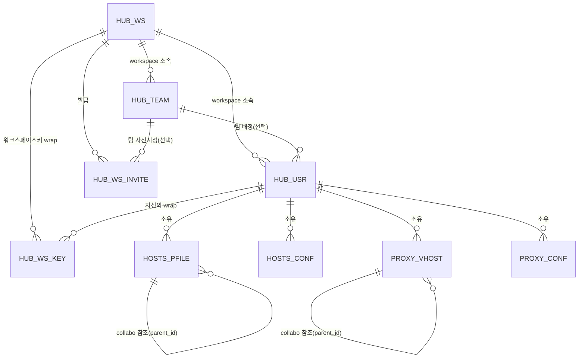

# 데이터베이스 스키마

이 문서는 oeHub가 사용하는 12개 테이블을 다룬다. 스키마는 `DatabaseConfig.initSchema()`(H2, `CREATE TABLE IF NOT EXISTS`)에 코드로 정의되어 있으며, 이 문서는 그 코드를 그대로 옮긴 것이 아니라 각 테이블의 존재 이유와 컬럼 설계 의도를 설명한다. 정확한 타입/제약조건은 소스가 원본이다.

개발 단계에서는 `ALTER TABLE`을 쓰지 않는다 — 스키마를 바꾸려면 `CREATE TABLE` 문 자체를 고치고, 기존 데이터베이스 파일(`~/oeHub/data/oeHub-h2.*`)을 지운 뒤 재시작한다. `CREATE TABLE IF NOT EXISTS`는 테이블이 이미 있으면 아무 일도 하지 않으므로, 이 파일을 지우지 않고 새 컬럼이 추가된 코드로 재시작하면 기존 테이블에 그 컬럼이 없는 상태로 남아 조회 시 SQL 오류가 난다.

## 공통 규칙

특별히 언급하지 않는 한 모든 테이블은 다음 네 컬럼을 가진다: `created_by`/`updated_by`(행을 만들거나 마지막으로 수정한 `HUB_USR.user_no`)와 `create_at`/`updated_at`(타임스탬프). 이 둘은 **외래키 제약을 걸지 않는다** — 실제 FK를 걸면 그 사람이 예전에 한 번이라도 만들거나 건드린 행이 남아있는 한 계정 삭제 자체가 막히기 때문이다(소프트 레퍼런스). 행위자를 알 수 없는 시스템 동작(마이그레이션 등)은 `0`을 쓴다 — `HUB_USR.user_no`가 `1000000000`부터 시작하도록 설계되어 있어 `0`은 실제 회원 번호와 절대 겹치지 않는 예약값이다.

## 관계도

## `HUB_WS` — 워크스페이스

테넌시의 최상위 단위. `standalone` 모드에서도 정확히 1행만 존재한다(§[04-deployment-modes.md](04-deployment-modes.md) "standalone이 특수한 경우가 아닌 이유" 참고) — "워크스페이스가 없는 모드"가 아니라 "워크스페이스가 1개로 고정된 모드"이기 때문이다.

- `status` — `active`/`suspended`. 인스턴스 admin의 워크스페이스 콘솔이 이 값을 토글한다. `suspended`가 되면 로그인이 즉시 차단되고(`AuthController.processLogin`), 이미 발급된 세션도 `token_version` 전체 증가로 함께 무효화된다.

## `HUB_TEAM` — 팀(부서) 라벨

워크스페이스 아래 한 단계짜리 조직 라벨. 검색·공유 범위와는 무관한 순수 필터/표시용이다(`HOSTS_PFILE.visibility`가 그 역할을 계속 전담). `ws_adm` 누구나 생성/이름변경/삭제할 수 있고, 소속 멤버가 있는 팀은 삭제가 거부된다(먼저 재배정해야 함). `HUB_USR`보다 먼저 생성돼야 `HUB_USR.team_no`의 FK가 성립한다.

## `HUB_USR` — 사용자 계정

- `role` — `adm`(인스턴스 관리자) / `ws_adm`(워크스페이스 관리자, 한 워크스페이스에 여러 명 가능) / `usr`(일반 구성원) / `ws_system`(로그인 불가능한 워크스페이스 소유 계정 — [소유자를 잃은 리소스](04-deployment-modes.md#계정-삭제와-소유자를-잃은-리소스)의 새 주인) / `pending`(승인 대기, 로그인 불가).
- `team_no` — nullable. 팀 미배정도 정상 상태다.
- `token_version` — 비밀번호 변경, 워크스페이스 정지 등으로 증가하며, 그 시점 이전에 발급된 JWT를 전부 무효화한다.
- `public_key`/`wrapped_private_key`/`wrapped_private_key_recovery`/`recovery_verifier` — 종단간 암호화의 개인키/복구 자료([05-end-to-end-encryption.md](05-end-to-end-encryption.md) 참고). `standalone` 모드에서는 공개키만 실제 값이고 나머지 세 컬럼은 고정 더미 문자열이다 — 아무도 그 계정의 콘텐츠를 암호화하지 않으므로 실제 키 자료를 만들 필요가 없다.
- `last_login_at` — 휴면 계정을 찾아 정리하는 용도(별도 상태 플래그 없이, `ws_adm`이 직접 보고 삭제하는 방식).

## `HUB_WS_INVITE` — 초대 코드

1인당 1회용 개별 코드(워크스페이스 전체가 공유하는 재사용 코드가 아님 — 코드 하나가 유출돼도 그 초대 하나만 위험해진다). `used`가 `TRUE`가 되는 순간 재사용 불가하며, `expires_at`이 지나도 마찬가지다. `team_no`(nullable)로 가입과 동시에 팀을 지정할 수 있다.

## `HUB_WS_KEY` — 워크스페이스키 wrap

워크스페이스 공유 대칭키(하나)를 멤버마다 그 사람의 개인 공개키로 감싼 것 — 그래서 기본키가 `(ws_no, user_no)` 복합키다. 새 멤버가 승인될 때, 승인하는 `ws_adm`의 브라우저가 자신이 캐시해 둔 워크스페이스키를 새 멤버의 공개키로 다시 감싸 이 테이블에 한 행 추가한다(서버는 감싸지지 않은 원본 키를 한 번도 보지 않는다). `HUB_USR`에 대한 FK는 실제 제약으로 걸려 있다(소프트 레퍼런스가 아님) — 계정 삭제 시 이 테이블의 행을 먼저 지워야 한다.

## `HUB_CONF` — 인스턴스 전역 설정

`conf_key`/`conf_val` 키-값 저장소. JWT 서명 키처럼 서버가 직접 읽어서 써야 하는 값들이라 애초에 암호화 대상이 될 수 없다(서버가 못 읽는 값으로는 서명을 검증할 수 없으므로).

## `HOSTS_PFILE` — oeHosts 프로필

- `visibility` — `private`/`collabo`/`public`. `public`의 의미가 배포 모드에 따라 달라진다([04-deployment-modes.md](04-deployment-modes.md) "visibility의 재해석" 참고).
- `parent_id` — `collabo` 공유의 참조 행. `HOSTS_PFILE` 자기 자신을 가리키는 자기참조 FK.
- `wrapped_content_key` — 이 행의 콘텐츠 키(DEK)를 감싼 것. `private`는 소유자 개인키로, `collabo`/`public`은 워크스페이스키로 감싼다. `group`이 아닌 `standalone`에서는 콘텐츠 자체가 평문이라 이 컬럼이 쓰이지 않는다.
- `link_content`/`wrapped_link_key` — "살아있는 공개 링크" 기능 전용([05-end-to-end-encryption.md](05-end-to-end-encryption.md) "공개 링크 공유" 참고). 링크 발급 여부와 무관하게 `hosts_content`/`wrapped_content_key`는 전혀 건드리지 않는다 — 완전히 별개의 암호문 계열이다.
- `uq_hosts_pfile_user_profile` — 같은 소유자 안에서 프로필 이름 중복 방지. 소유자가 `ws_system`으로 바뀌는 재할당 시 이름이 충돌하면 자동으로 뒤에 번호를 붙여 회피한다.

## `HOSTS_CONF` — oeHosts 개인 설정

사용자별 소소한 설정값(기본 열기 URL, 시크릿 모드 여부 등). 암호화 범위에서 의도적으로 제외되어 있다 — 서버 렌더링 설정 화면과 내보내기 기능이 이 값을 평문으로 직접 읽어야 하고, 애초에 다른 사람과 공유되는 값도 아니다.

## `HOSTS_UA` / `HOSTS_URL` — User-Agent / URL 프리셋

`user_no`가 `NULL`이면 관리자가 관리하는 전역 프리셋, 값이 있으면 그 사용자의 개인 프리셋이다. 워크스페이스별로 나뉘지 않고 인스턴스 전체가 공유하는 카탈로그로 유지된다 — 사용자 소유 데이터가 아니라 참고용 목록이라는 성격으로 본다.

## `PROXY_VHOST` — oeProxy 가상 호스트

`HOSTS_PFILE`과 거의 같은 모양(소유자·가시성·collabo 참조·정렬순서)이다. `wrapped_content_key`/`link_content` 컬럼이 스키마에는 있지만 **실제로는 채워지지 않는다** — 리버스/포워드 프록시가 라우팅 테이블을 만들려면 이 콘텐츠를 서버가 직접 평문으로 파싱해야 해서, 애초에 암호화할 수 있는 경우가 구조적으로 없기 때문이다([05-end-to-end-encryption.md](05-end-to-end-encryption.md) 참고). `workspace` 모드에서는 oeProxy 자체가 꺼져 있어 이 테이블에 행이 생길 일이 없다.

## `PROXY_CONF` — oeProxy 개인/전역 설정

`HOSTS_CONF`와 같은 모양(`user_no`가 `NULL`이면 전역, 있으면 개인). OID HMAC 비밀값처럼 서버가 직접 읽어야 하는 시스템 설정과, `local_svr` 같은 개인 라우팅 오버라이드를 함께 담는다.
